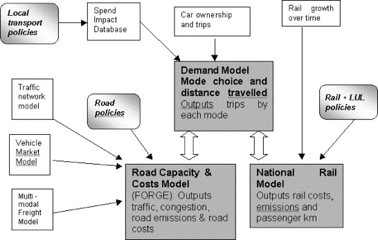
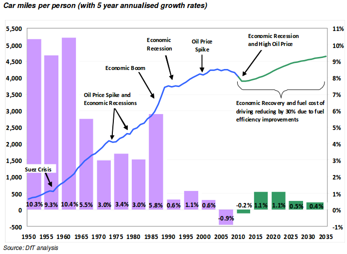

Cycling projections in the National Transport Model - Briefing document
========================================================

## Context

With recent policy announcements on cycling and increased uptake in many urban areas, 
now is a good time to think about future scenarios of active travel. 
Quantitative models are a powerful tool in the transport planner's toolkit for 
developing policies to maximise the potential benefits of cycling. 
This briefing sets out the government aspirations, describes the NTM and its (lack of) 
cycling projects and, finally, outlines possibilities to create more ambitious scenarios
of bicycle use at the national level.

### Government aspirations

The UK government has has committed to increase the rate of cycling from its current
level for economic, health and environmental benefit.
This was set-out in the press release of a fresh tranch of money to promote cycling
as a form of transport in target cities and national parks.

"Currently, only 2% of trips in the UK are made by bike, 
compared with 14% in Germany and almost a third in the Netherlands" 
([Prime Minister's office](https://www.gov.uk/government/news/government-shifts-cycling-up-a-gear)). 

In the press release, David Cameron stated that "we want to see cycling soar".
"This government wants 
to make it easier and safer for people who already cycle as well as
encouraging far more people to take it up".

These aspirations are echoed by the All Party Parliamentary Cycling Group  (APPCG), 
which recommended concrete and measurable targets to accompany the investment:
"The government should set national targets to increase cycle use
from less than 2% of journeys in 2011, to 10% of all journeys in 2025,
and 25% by 2050". These targets relate to *the proportion of all trips* 
made by cycling, so are robust to shifts in the demand for travel and population growth.

### Cycling in the National Transport Model

Despite the recent high-level interest in cycling, the Department for Transport 
did not publish its projections for the cycling rate in the latest report of NTM's findings (DfT 2013),
in contrast to its 2012 report on NTM projections (DfT 2012).
Cycling is mentioned 3 times in the extensive 2013 report on the NTM (DfT 2013). 
Yet projections of the actual cycling rate were omitted from the report, 
despite "cycle lanes and schemes" being mentioned as a "major" factor influencing 
road travel. 

Information about cycling projections in the NTM was made public following a parliamentary 
[question](http://www.publications.parliament.uk/pa/cm201314/cmhansrd/cm131031/text/131031w0001.htm#131031w0001.htm_wqn6). It was stated that "These [NTM] forecasts assume that 
the impact of smarter measures will increase cycling trips 
by 5% in 2015, 7.5% in 2025, and 10% in 2035."
It has since been clarified that these increases refer to increases *relative to the baseline*
scenario. Given that APPCG's recommended target ammounts to roughly a **500%** increase in 
cycling on current levels, based on new policies, these increases relative to the baseline are tiny
and unambitious in the extreme. Many cities have experienced double-digit 
percentage increases in cycling *per year*, suggesting at least a doubling 
in cycle use by mid-century if current trends continue (Lovelace et al. 2011). 

Another issue with the communication about the NTM's handling of cycling is that
it uses units that are different from those recommended by cycling reports.
The NTM has reported the rate of cycling relative to an unpublished baseline, 
and as absolute number of trips and distance nationwide. 
It would be more appropriate to measure the rate of cycling *per person*
or as a share of trips/distance rather than
in these absolute terms which are strongly affected by population. 
In addition, even if the projections were per person, they are 
moderate.

The central population projection made by the DfT (2013)
is for a 20% between 2010 and 2040. This suggests that **the NTM projects 
the rate of cycling per person to drop in absolute terms**. 

The overall *distance travelled* by cyclists is expected to 
peak around 2015, stabilising to 3.1 billion miles by 2040, from 
2.9 billion miles in 2010. This corresponds to a **14% drop in the 
distance travelled per person by bicycle over the same time frame**, 
once a 20% growth in population has been factored-in.
The CTC has stated that these projections amount to 
"[planning to fail](http://www.ctc.org.uk/news/government-planning-to-fail-on-cycling)".

!!!Add image of cycle projections by APPCG

The cycling projections in the NTM have been 

## The National Transport Model

The [National Transport Model](http://webarchive.nationalarchives.gov.uk/20110202223628/http://www.dft.gov.uk/pgr/economics/ntm/) (NTM) is designed to provide a "a systematic means of comparing
the national consequences of alternative national transport policies 
or widely-applied local transport policies". The model should provide a range of scenarios that
"take into account the major factors affecting future patterns of travel."

The central projections of the NTM are influential, because they are the highest-level 
model results on which many decisions are made. 

accounting for "" 
scenarios which take into account the major factors affecting future patterns of travel."

The NTM has a modular structure, with a central demand model interacting with rail and road modules
(Chatterjee & Gordon 2006):

## Assumptions of the NTM

The NTM, like any model, makes simplifying assumptions
in order to produce quantitative projections of change. 
Rather than setting the travel patterns directly, trip rates
are set as a function of "background scenarios", taken from other sources. 
Primary among these are gross domestic product (GDP) and population growth assumptions
(DfT 2013). Key to the NTM's outputs are these inputs and the link between 
GDP and travel patterns via car ownership and use: "The main determinant of car ownership 
is income and the car ownership results strongly reflect GDP growth" (Chatterjee and Gordon, 2006, p. 258). 

This vision of a 'return to normality' driven by stable oil prices and a strong 
economic recovery for the many is starkly illustrated in the following figure (DfT 2012).

These projections contrast sharply with discussion of systemic changes in 
transport behaviour in advanced economy, labeled as "peak travel" and 
"peak car" in the academic literature (Millard-Ball & Schipper 2010; Goodwin 2012).

## Possibilities for more ambitious NTM scenarios

## References

Chatterjee, K., & Gordon, A. (2006). Planning for an unpredictable future: Transport in Great Britain in 2030. Transport Policy, 13(3), 254–264. doi:10.1016/j.tranpol.2005.11.003

Department for Transport (2012). Road Transport Forecasts 2011. Results from the Department for
Transport's National Transport Model. [www.gov.uk](https://www.gov.uk/government/uploads/system/uploads/attachment_data/file/4243/road-transport-forecasts-2011-results.pdf)

Department for Transport (2013). Road Transport Forecasts 2013
Results from the Department for Transport's National Transport Model. Accessed from 
[www.gov.uk](https://www.gov.uk/government/uploads/system/uploads/attachment_data/file/260700/road-transport-forecasts-2013-extended-version.pdf)

Lovelace, R., Beck, S. B. M. B. M., Watson, M., & Wild, A. (2011). Assessing the energy implications of replacing car trips with bicycle trips in Sheffield, UK. Energy Policy, 39(4), 2075–2087. doi:10.1016/j.enpol.2011.01.051

Goodwin, P. (2012). Peak travel, peak car and the future of mobility: evidence, unresolved issues, and policy implications, and a research agenda. In International Transport Forum Discussion Papers (No. 2012/13). OECD Publishing.

Millard-Ball, A., & Schipper, L. (2010). Are We Reaching a Plateau or “Peak” Travel? Trends in Passenger Transport in Six Industrialized Countries. Transportation Research Record, 2(1), 1–26. Retrieved from http://www.stanford.edu/~adammb/Publications/Millard-Ball Schipper 2010 Peak travel.pdf