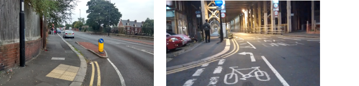
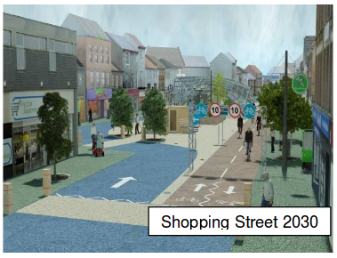

## What could happen if we get serious about cycling

Current expectations:




## The kind of thing that's needed:




## Policy context

- GBC report published spring 2013 with ambitious plan for cycling

- Since then there has been little commitment to cycling from
main political parties of DfT

- Parliamentary Question tabled by CTC revealed complete lack
of ambition for cycling the the National Transport Model

- DfT is currently updating its handling of cycling, but
it will likely fall short of the vision needed to transform cycling in UK

- This research provides detail in space, time and demographics
of how the shift to cycling could look in the coming years

## Context: in graphics

```{r, echo=FALSE}
library(ggplot2)
load("df2050.Rdata")
ggplot() + geom_vline(xintercept = c(2025, 2050), linetype = 3) + geom_hline(yintercept = c(10, 25), linetype = 2) + geom_line(data = dfline, aes(x = Year, y = prop.cycle, color = model)) + geom_point(data = dfdots, aes(x = Year, y = prop.cycle, shape = model)) + ylab("Percentage of trips by bicycle") +  theme_bw() + scale_color_brewer(type = "qual", palette = 6, name = "Model") + scale_shape_discrete(name = "Data", solid = F) + geom_text(aes(px, py, label = ptext), size = 4)
```


## The approach

- Occam's razor approach used: start simple, add complexity
(distance, mode, spatial and temporal variables)

- Avoids distinction between
'cyclists' and 'non-cyclists'

- Scenarios are 'top down' overall but assignment 'bottom up' 

```{r, echo=FALSE}
# in that they are driven by
# official reports, but 'bottom up' in using probabilities
# of individual stages switching mode as basis for
# disaggregation
# Robust to changes in population and
# travel rates. Allows easy incorporation in microsimulation model.
```

- Focus on stages

- Outputs: increase in km cycled per person by place and time;
concomitant decrease in driving

## Modelling stages

1. Scenario development - overall % stages by bicycle nationwide

2. Allocation of stages to individuals depending on distance, mode and
socio-demographic variables

3. Disaggregate by Local Authority

4. Ouput results into format useable by health and transport economists
to estimate monetary savings

## 4 scenarios of change

- DfT: doubling in *number* (+74%) of stages made by bicycle to 2026
- Slow start: DfT until 2026 and acceleration to meet GBC by 2050
- 'Go Dutch': cycling uptake in a car-dominated world
- 'Ecotechnic': demand restraint and active travel

## 4 scenarios of change, visualised

```{r, echo=FALSE}
# DfT scenario 
s1 <- seq(0.017, 0.017 * 1.793, length.out = 11) # the sequence to 2025 - CP
# s1 <- seq(0.017, 0.017 * 1.083, length.out = 11) # the sequence to 2025 - PQ
p.yr <- s1[2] - s1[1]
dftend <- p.yr * 35 + 0.017
sdft <- seq(0.017, dftend, length.out = 36) * 100

dft <- data.frame(Year = 2015:2050, Perc_stages = sdft, Scenario = "DfT")
```

```{r, echo=FALSE}
# slow start
k = 26
B = sdft[11] 
r = 0.15
time = 0:25
lgrowth <- (B * k * exp(r * time)) / (k + B * (exp( r * time) - 1) ) 
# plot(lgrowth)
slow_start <- dft
slow_start$Scenario <- "Slow start"
slow_start$Perc_stages[11:36] <- lgrowth 
# plot(slow_start$Year, slow_start$Perc_stages)
```

```{r, echo=FALSE}
# Go Dutch scenario
k = 27
B = 1.7
r = 0.15
time = 0:35
lgrowth <- (B * k * exp(r * time)) / (k + B * (exp( r * time) - 1) ) 
# plot(lgrowth)
go_dutch <- dft
go_dutch$Scenario <- "Go Dutch"
go_dutch$Perc_stages <- lgrowth
# plot(go_dutch$Year, go_dutch$Perc_stages)

ecotech <- go_dutch
ecotech$Scenario <- "Ecotechnic"
```

```{r, echo=FALSE}
s2050 <- rbind(dft, slow_start, go_dutch, ecotech)
ggplot() + geom_vline(xintercept = c(2025, 2050), linetype = 3) + geom_hline(yintercept = c(10, 25), linetype = 2) + geom_line(data = s2050, aes(x = Year, y = Perc_stages, color = Scenario, linetype = Scenario)) + ylab("Percentage of trips by bicycle") +  theme_bw() + scale_color_brewer(type = "qual", palette = 6, name = "Model") + scale_shape_discrete(name = "Data", solid = F) + geom_text(aes(2020, py, label = ptext), size = 4) +
  scale_linetype_manual(values = c(1,1,1,2), guide = "none")
# ggsave("figures/stages.png")
```

## NTS: foundation of future scenarios

- Travel in the UK's National Travel Survey (NTS) is measured in stages and trips.

- Data in the NTS is contains information on
households, vehicles, individuals, trips and stages.

- The NTS is the basis of the future scenarios produced by the
Department for Transport (DfT) and in this study.

- We therefore begin with current data from the NTS and move forward

- Sample of individuals taken from NTS forms basis of weekly activity
patterns, to be translated into health impacts

```{r, echo=FALSE, eval=FALSE}
# setwd("/media/robin/SAMSUNG/data/DfT-NTS-2002-2008/UKDA-5340-spss/spss/spss12/")
# stages <- read.spss("stage.sav")
# stages <- as.data.frame(stages)
# trips <- read.spss("trips.sav")
# trips <- as.data.frame(trips)
```

```{r, echo=FALSE, eval=FALSE}
# set.seed(100)
# ssam <- stages[sample(nrow(stages), size = nrow(stages) / 20), ]
# 
# # Now merge the sample stages with trip information
# library(dplyr)
# ssam <- inner_join(ssam, trips) # this will 
# names(ssam)
# plot(ssam$sd, ssam$jdungross)
# ssam[1:5, c("jdungross")]
# write.csv(ssam, file = "stages-sample.csv")
# write.csv(ssam[1:5000,], file = "minisample.csv")
# length(unique(ssam$X))
# sum(as.numeric(ssam$s1) > 1) / length(unique(ssam$X)) # 96% only 1 stage
```

## National trip rates and modelling change

- Stages are the atomic elements of the NTS (7.8 vs 9.1 miles)

- A logical basis against which to model modal shift.

- DfT projects **doubling** in the number of stages by bicycle by 2025.

- Assume (for now) that stage distances and total number remain
constant 

## Proportion of trips made by bicycle

- Currently cycling accounts for just under 2% of
all stages, commuting taking up disproportionate share of cycle trips:

```{r, echo=FALSE}
ssam <- read.csv("~/Desktop/stages-sample.csv") # from
ssam$mode <- as.character(ssam$s24a)
ssam$mode[grep("Other|Tax|Moto|LT|Rail", ssam$s24a)] <- "Other"
ssam$mode[grep("bus", ssam$s24a)] <- "Bus"
ssam$mode <- factor(ssam$mode)
t1 <- summary(ssam$mode) / nrow(ssam)
ssam$purp <- as.character(ssam$j28a)
ssam$purp[grep("Visit", ssam$purp)] <- "Visiting.friends"
library(knitr)
All_modes <- table(ssam$purp)
# sort(tt) # visiting friends, commuting, shopping are all
pt <- table(ssam$mode, ssam$purp)
pt <- rbind(All_modes, pt)
pt <- prop.table(pt, margin = 1)[,c("Shopping", "Commuting", "Visiting.friends")]
pt <- as.data.frame(pt)
pt$Other <- 1 - rowSums(pt)
pt$Percent <- c(1, t1)
# kable(100 * pt, digits = 1)
```

|                  | Shopping| Commuting| Visiting.friends| Other| Percent|
|:-----------------|--------:|---------:|----------------:|-----:|-------:|
|All_modes         |     18.6|      17.4|             16.2|  47.8|   100.0|
|Bicycle           |     12.0|      32.9|             13.6|  41.5|     1.7|
|Bus               |     26.4|      20.6|             13.9|  39.0|     7.5|
|Car/van driver    |     19.7|      22.0|             13.4|  44.9|    46.4|
|Car/van passenger |     17.8|       6.8|             23.5|  51.9|    25.9|
|Walk              |     16.8|      11.9|             13.4|  57.9|    12.6|

## Distance distribution of stages

- Network distance and mode are the most important parameters
for determining probability of shifting mode

```{r, echo=FALSE, message=FALSE}
ggplot(ssam[ ssam$sd < 300, ]) + geom_histogram(aes(x = sd/10, fill = mode)) + scale_fill_brewer(type = "qual") + xlab("Miles")
```

## The simplest case

- In the simplest case, cycling trips double by
swapping 1.7% of stages to cycling in every band:

```{r, echo=FALSE, message=FALSE}
simplest <- ssam$mode
sts <- NA
udists <- unique(ssam$sd)
bike <- ssam$mode == "Bicycle" # rows not bikes
nbike <- !bike
for(i in udists){
  s_temp <- which(ssam$sd == i & nbike)
  l <- length(s_temp)
  sts <- c(sts, sample(s_temp, size = l * 0.018))
}
sts <- sts[-1]
# summary(simplest[sts])
simplest[sts] <- "Bicycle"
ssam$simple <- simplest

ggplot(ssam[ ssam$sd < 300, ]) + geom_histogram(aes(x = sd/10, fill = simple)) + scale_fill_brewer(type = "qual") + xlab("Miles")
```

## A close up of cycling

- Distribution of **cycling**
stages has grown, shifted to the right:

```{r, echo=FALSE, message=FALSE}
ssam$dkm <- ssam$sd / 10 * 1.61
df1 <- data.frame(dkm = ssam$dkm[ssam$mode == "Bicycle"], scenario = "Current" )
df2 <- data.frame(dkm = ssam$dkm[ssam$simple == "Bicycle"], scenario = "Simplest")
df12 <- rbind(df1, df2)
ggplot(df12) + geom_histogram(aes(dkm)) + facet_grid(~ scenario) + xlim(c(0, 30)) +
  xlab("Distance")
```

## Incorporating distance

- Simplest example is unrealistically assumes
equal proportion of trips shift for every distance band

- In practice it's more like an exponential decay (Iacono et al., 2011)

- Distance can be accounted for by setting probability
of a shift as a function of distance

$$p = \alpha e^{-\beta d}$$

## Incorporating distance II

- Values from Iacono et al. (2011) were used: $\alpha = 0.4$,
$\beta = 0.2$ for bicycle trips
- These parameters can and should be updated with better evidence

- Distance decay, $\beta$ is dependent on trip purpose,
kept constant for now

## Incorporating distance III

- The results look the same as for the simplest scenario
yet they are subtly different

```{r, echo=FALSE, message=FALSE}
iac <- function(x, a, b){
  a * exp(1)^(-b * x)
}
# plot(iac(1:10, 0.4, 0.3)) # test it makes sense
pswitch <- iac(ssam$dkm, a = 0.3, b = 0.2)
pswitch[!nbike] <- 0 # probability of switch for cyclists = 0
# plot(pswitch, ssam$dkm)
set.seed(100)
sel <- sample(nrow(ssam), size = length(which(ssam$mode == "Bicycle")), prob = pswitch)
ssam$pswitch_d <- pswitch
ssam$dswitch <- ssam$mode
ssam$dswitch[sel] <- "Bicycle"

ggplot(ssam[ ssam$sd < 300, ]) + geom_histogram(aes(x = sd/10, group = dswitch, fill = dswitch),) + scale_fill_brewer(type = "qual") + xlab("Miles") + stat_bin(aes(x = sd/10, y = ..density..)) # not density
# ggplot(ssam[ ssam$sd < 300, ], aes(x = sd/10, group = dswitch, fill = dswitch)) + stat_bin(aes(x = sd/10, y = ..density..)) + scale_fill_brewer(type = "qual") + xlab("Miles") 
```

## Comparing 'distance switch' with simplest scenario

- The purpose of the distance-dependent probability of switch
was to provide more realistic switching
- Proportion of trips > 10 miles by bike:

```{r, echo=FALSE}
# How many cycle stages > 10 miles
p10 <- c(length(which(ssam$mode == "Bicycle" & ssam$sd > 100)),
length(which(ssam$simple == "Bicycle" & ssam$sd > 100)),
length(which(ssam$dswitch == "Bicycle" & ssam$sd > 100)))

nbs <- c(length(which(ssam$mode == "Bicycle")),
length(which(ssam$simple == "Bicycle")),
length(which(ssam$dswitch == "Bicycle")))
p10 <- p10 / nbs * 100
p10 <- as.data.frame(t(p10))
names(p10) <- c("Current", "Simplest case", "Distance-decay")
# kable(p10, digits = 1) 
```
- Overcomes issue of unrealistic % of long trips by bike in simplest scenario

| Current| Simplest case| Distance-decay|
|-------:|-------------:|--------------:|
|     1.8|           7.2|            1.2|

## Comparing the scenarios II

```{r, echo=FALSE, message=FALSE}
df1 <- data.frame(dkm = ssam$dkm[ssam$mode == "Bicycle"], scenario = "Current" )
df2 <- data.frame(dkm = ssam$dkm[ssam$simple == "Bicycle"], scenario = "Simplest")
df3 <- data.frame(dkm = ssam$dkm[ssam$dswitch == "Bicycle"], scenario = "Distance switch")
df <- rbind(df1, df2)
df <- rbind(df, df3)
ggplot(df) + geom_histogram(aes(dkm)) + facet_grid(~ scenario) + xlim(c(0, 30)) +
  xlab("Distance")

# c(length(which(ssam$mode == "Bicycle" & ssam$sd > 1)),
# length(which(ssam$simple == "Bicycle" & ssam$sd > 1)),
# length(which(ssam$dswitch == "Bicycle" & ssam$sd > 1)))
```

## Including mode of travel

With the per-trip probabilistic modelling framework set-up,
driven by prior knowledge of the number/proportion of stages
to be made by bicycle, it is easy to refine.

- Evidence suggests bicycle uptake disproportionately
replaces walking and bus travel than car journeys
- To include this subtlety, we simply
assign a relative weight to each mode of travel, indicating
how much more likely it is to be replaced by bicycle trips than
the others
- If a car we set at 0.5 and bus at 1, for example, half the
number of car journeys, on average, would be replaced by bicycle
trips than would bus stages
- The absolute probabilities do not matter, as these are determined
by the sample size in R's `sample` function (as long as p < 1)

## Altering mode-specific probabilities

```{r, echo=FALSE}
# summary(ssam$j36a[ssam$mode == "Other"])
mdf <- data.frame(Bus = 1, Car.d = 0.5, Car.p = 0.6, Other = 0.5, Walk = 1)
# kable(mdf)
psm <- ssam$pswitch_d
psm[ssam$mode == "Car/van driver"] <- psm[ssam$mode == "Car/van driver"] * 0.5
psm[ssam$mode == "Car/van passenger"] <- psm[ssam$mode == "Car/van passenger"] * 0.6
psm[ssam$mode == "Other"] <- psm[ssam$mode == "Other"] * 0.5
```

| Bus| Car.d| Car.p| Other| Walk|
|---:|-----:|-----:|-----:|----:|
|   1|   0.5|   0.6|   0.5|    1|

```{r, echo=FALSE}
# Switches occuring taking mode and distance into account
set.seed(100)
sel <- sample(nrow(ssam), size = length(which(ssam$mode == "Bicycle")), prob = psm)
ssam$dmswitch <- ssam$mode
ssam$dmswitch[sel] <- "Bicycle" # Switches taking mode and distance
ssam$pswitch_md <- psm
```

```{r, echo=FALSE}
tchange <- rbind(
summary(ssam$mode[ssam$mode != "Bicycle" & ssam$dswitch == "Bicycle"]),
summary(ssam$mode[ssam$mode != "Bicycle" & ssam$dmswitch == "Bicycle"]))/
  length(which(bike)) * 100
tchange <- round(tchange, 1)
tchange <- cbind(c("Distance", "Distance + Modes"), tchange)
# kable(tchange, digits = 1) 
```

- Possible issue of double counting 
- Comparison of modes that were replaced by new bicycle trips
- Outcome is policy dependent: e.g. congestion charges
- E.g. cuts to bus services -> more bus journeys replaced

## The impact of mode-specific probabilities:

% trips replaced by bicycle in different scenarios:

|                 |Bicycle |Bus  |Car/van driver |Car/van passenger |Other |Walk |
|:----------------|:-------|:----|:--------------|:-----------------|:-----|:----|
|Distance         |0       |6.8  |42.9           |25.8              |3.4   |21.1 |
|Distance + Modes |0       |11.2 |32.8           |21.9              |3.2   |31   |

- No strong evidence on likely distribution
- Just distance scenarios used at present for 'policy neutrality'

## Including trip purpose

```{r, echo=FALSE}
# Too complex - just table's fine
# library(reshape2)
# ptm <- melt(cbind(row.names(pt)[-1], pt[-1,-7] * 100))
# names(ptm) <- c("Mode", "Purpose", "Percent")
# qplot(x = Purpose, y = Percent, fill = Mode, data = ptm, geom = "bar", position = "dodge" )
```

|                  | Shopping| Commuting| Visiting.friends| Other| Percent|
|:-----------------|--------:|---------:|----------------:|-----:|-------:|
|All_modes         |     18.6|      17.4|             16.2|  47.8|   100.0|
|Bicycle           |     12.0|      32.9|             13.6|  41.5|     1.7|
|Bus               |     26.4|      20.6|             13.9|  39.0|     7.5|
|Car/van driver    |     19.7|      22.0|             13.4|  44.9|    46.4|
|Car/van passenger |     17.8|       6.8|             23.5|  51.9|    25.9|
|Walk              |     16.8|      11.9|             13.4|  57.9|    12.6|

- Current preferences may not reflect future change
- Low % could represent aversion to cycling for shopping. Or growth potential...
- Probabilities of switch by purpose is highly policy dependent

## Including socio-demographics

- Not is inclined to cycle, especially in car-dominated settlements
with poor cycle infrastructure
- Variability is a function of age: the young have been responsible for
most growth in cycling in London and some elderly cannot cycle
- Large implications for health savings
- Strategy: modify probability of switching each stage to bicycle based on the
age of the traveller

## Including space

- To take account of space, we subset individuals by region (variable j58g)
- The characteristics of *current* trips in each region will then filter-down
into probability of modal shift
- This will provide insight into how high growth rates will have to be
in London for nationwide targets to be met

## Trips distributions by region I

```{r, message=FALSE, echo=FALSE}
gssam <- ssam[ grep("Lon|York|North E|Scotl", ssam$j58g),]

ggplot(gssam[ gssam$sd < 300, ]) + geom_histogram(aes(x = sd/10, fill = mode)
  #   , stat = "density"
) +
  scale_fill_brewer(type = "qual") +
  facet_wrap(~ j58g) + xlab("Miles") + ylab("Number of trips")

```

## Trips distributions by region II

```{r, message=FALSE, echo=FALSE}
ggplot(gssam[ gssam$sd < 300, ]) + geom_histogram(aes(x = sd/10, fill = mode)
#   , stat = "density"
    , position = "fill"
  ) +
  scale_fill_brewer(type = "qual") +
  facet_wrap(~ j58g) + xlab("Miles") + ylab("Proportion of trips")
```

## Energy savings by 2050

```{r, echo=FALSE, message=FALSE}

# summary(ssam$mode)
ssam$epkm <- 0
ssam$epkm[ grep("driv", ssam$mode)  ] <- 3
ssam$epkm[ grep("Bus", ssam$mode)  ] <- 2

ssam$esave <- ssam$epkm * ssam$dkm 

sel_simple <- ssam$simple == "Bicycle" & ssam$mode != "Bicycle"
# sum(ssam$esave[sel_simple])

ssam$esave_s <- ssam$esave
ssam$esave_s[!sel_simple] <- 0

tsum <- tapply(ssam$esave, INDEX = ssam$j58g, FUN = function(x) sum(x, na.rm = T))
gorsum <- tapply(ssam$esave_s, INDEX = ssam$j58g, FUN = function(x) sum(x, na.rm = T))
# sum(gorsum)

eframe <- data.frame(Region = names(gorsum), Simple = gorsum / tsum)

sel_ds <- ssam$dswitch == "Bicycle" & ssam$mode != "Bicycle"
# sum(ssam$esave[sel_ds])

ssam$esave_ds <- ssam$esave
ssam$esave_ds[!sel_ds] <- 0
gorsum <- tapply(ssam$esave_ds, INDEX = ssam$j58g, FUN = function(x) sum(x, na.rm = T))
# sum(gorsum)
eframe$Dswitch <- gorsum / tsum

library(reshape2)
eframe <- melt(eframe)
names(eframe) <- c("Region", "Scenario", "Proportion")
qplot(x = Region, y = Proportion, fill = Scenario, data = eframe, geom = "bar", position = "dodge", stat = "identity") +
  theme(axis.text.x = element_text(angle = 90, hjust = 1))
ggplot() + geom_point(aes(x = eframe$Region, y = eframe$Proportion))
  # energy savings 'distance switch = 2.7 * less than overall)

# sum(ssam$epkm[sel_ds] * ssam$dkm[sel_ds]) / sum(ssam$epkm * ssam$dkm)
# 0.4% energy savings overall
# - Energy savings nearly 3 times less than
```

## Discussion and conclusion

- Region -> LA -> individual -> trip -> stage level analysis 

```{r, echo=FALSE}
# is feasible
# and allows estimation of nature of trips most likely to shift to cycling
# under different scenarios over space and time
```


- Short-term GBC parliamentary debate, monetary valuation is needed
- Increased physical activity due to cycling will be an output
- Emissions savings: relatively straightforward
- Estimating congestion savings still a challenge
- Mid-term aim: use scenarios to update 2011 work: Energy implications of modal
shift to cycling to 2050 in the UK


